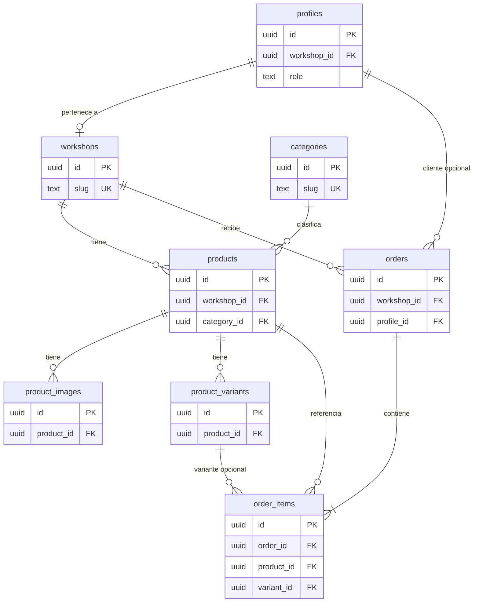

# Plan técnico Supabase — AtresColombia

Documento de preparación **antes** de conectar Supabase.  
Basado en el estado actual del proyecto (Sprints 1–5): catálogo público desde `src/data/`, panel admin en `localStorage`, carrito en `localStorage`, sin autenticación real.

**No implementa conexión.** Solo define el modelo de datos y el orden de migración.

---

## 1. Estado actual del panel y datos simulados

### Fuentes de verdad hoy

| Área | Fuente actual | Ubicación |
|------|---------------|-----------|
| Talleres (público) | Archivo estático | `src/data/workshops.ts` |
| Productos (público) | Archivo estático | `src/data/products.ts` → `product-repository` |
| Categorías | Archivo estático | `src/data/categories.ts` |
| Panel admin | `localStorage` | clave `atres-colombia-admin-products` |
| Carrito | `localStorage` | clave `atres-colombia-cart` |
| Favoritos | `localStorage` | hook `use-favorites` |
| Pedidos | No persistidos | solo mensaje WhatsApp simulado |
| Usuarios / auth | No existe | panel abierto sin login |

### Panel admin (`/panel`)

Rutas existentes:

- `/panel` — dashboard con métricas
- `/panel/productos` — listado, búsqueda, filtros
- `/panel/productos/nuevo` — formulario de creación
- `/panel/productos/[id]/editar` — edición

El panel **no sincroniza** con el catálogo público. Los cambios quedan en el navegador del operador.

### Entidades TypeScript de referencia

- `Workshop` / `WorkshopRecord` → tabla `workshops`
- `ProductSeed` + `normalize.ts` → `products`, `product_images`, `product_variants`
- `AdminProduct` → campos del panel (stock, status, personalización)
- `Category` → tabla `categories`
- `CartItem` + agrupación por taller → base para `orders` / `order_items`

---

## 2. Diagrama de relaciones



---

## 3. Tablas y campos

Convenciones propuestas:

- PK: `uuid` generado por Supabase (`gen_random_uuid()`)
- Timestamps: `created_at`, `updated_at` en todas las tablas principales
- Slugs: únicos por tabla (`unique`)
- Montos: `integer` en COP (sin decimales), coherente con `formatPrice`
- Enums: `text` + check constraint o tipo `enum` de Postgres

---

### 3.1 `workshops`

Representa talleres y tiendas. Equivalente a `WorkshopRecord`.

| Campo | Tipo | Nullable | Notas |
|-------|------|----------|-------|
| `id` | `uuid` | NO | PK |
| `slug` | `text` | NO | UNIQUE, ej. `atres-colombia` |
| `name` | `text` | NO | |
| `kind` | `text` | NO | `workshop` \| `store` |
| `verified` | `boolean` | NO | default `false` |
| `location` | `text` | NO | Texto completo, ej. "Bogota, Cundinamarca" |
| `city` | `text` | NO | |
| `department` | `text` | NO | |
| `description` | `text` | NO | |
| `specialties` | `text[]` | NO | default `{}` |
| `rating` | `numeric(2,1)` | NO | default `0` |
| `review_count` | `integer` | NO | default `0` |
| `cover_image_url` | `text` | NO | |
| `logo_url` | `text` | NO | |
| `phone` | `text` | YES | |
| `whatsapp` | `text` | YES | solo dígitos, sin `+` |
| `email` | `text` | YES | |
| `website` | `text` | YES | |
| `socials` | `jsonb` | YES | `{ instagram, facebook, tiktok }` |
| `production_time` | `text` | NO | ej. "5 a 7 dias habiles" |
| `minimum_order` | `integer` | YES | |
| `supports_customization` | `boolean` | NO | default `false` |
| `supports_home_trial` | `boolean` | NO | default `false` |
| `delivery_cities` | `text[]` | NO | default `{}` |
| `category_slugs` | `text[]` | NO | slugs de categorías que maneja |
| `status` | `text` | NO | `active` \| `pending` \| `inactive` |
| `created_at` | `timestamptz` | NO | default `now()` |
| `updated_at` | `timestamptz` | NO | default `now()` |

**Índices:** `slug`, `status`, `city`

**Nota:** `product_count` no se almacena; se calcula con `count(products)`.

---

### 3.2 `categories`

Catálogo global de categorías. Equivalente a `Category`.

| Campo | Tipo | Nullable | Notas |
|-------|------|----------|-------|
| `id` | `uuid` | NO | PK |
| `slug` | `text` | NO | UNIQUE, ej. `chaquetas` |
| `name` | `text` | NO | |
| `description` | `text` | YES | |
| `sort_order` | `integer` | NO | default `0` |
| `is_active` | `boolean` | NO | default `true` |
| `created_at` | `timestamptz` | NO | |
| `updated_at` | `timestamptz` | NO | |

**Relación:** `products.category_id` → `categories.id`  
**No depende de `workshop_id`.** Es catálogo compartido de la plataforma.

---

### 3.3 `products`

Producto principal. Une taller + categoría. Equivalente a `ProductSeed` + campos de `AdminProduct`.

| Campo | Tipo | Nullable | Notas |
|-------|------|----------|-------|
| `id` | `uuid` | NO | PK |
| `workshop_id` | `uuid` | NO | FK → `workshops.id` |
| `category_id` | `uuid` | NO | FK → `categories.id` |
| `slug` | `text` | NO | UNIQUE global o UNIQUE(workshop_id, slug) |
| `name` | `text` | NO | |
| `description` | `text` | NO | descripción corta |
| `long_description` | `text` | NO | |
| `price` | `integer` | NO | COP |
| `previous_price` | `integer` | YES | |
| `discount_label` | `text` | YES | ej. `17%` |
| `available` | `boolean` | NO | default `true` |
| `made_to_order` | `boolean` | NO | default `false` |
| `allows_customization` | `boolean` | NO | del panel admin |
| `allows_home_trial` | `boolean` | NO | del panel admin |
| `stock` | `integer` | NO | default `0`, inventario agregado |
| `stock_level` | `text` | NO | `in_stock` \| `low_stock` \| `made_to_order` \| `out_of_stock` |
| `status` | `text` | NO | `active` \| `inactive` (panel) |
| `is_new` | `boolean` | NO | default `false` |
| `material` | `text` | YES | |
| `fabrication_time` | `text` | YES | |
| `care_instructions` | `text` | YES | |
| `origin` | `text` | YES | |
| `rating` | `numeric(2,1)` | NO | default `0` |
| `review_count` | `integer` | NO | default `0` |
| `sold_count` | `integer` | NO | default `0` |
| `created_at` | `timestamptz` | NO | |
| `updated_at` | `timestamptz` | NO | |

**Índices:** `workshop_id`, `category_id`, `slug`, `status`, `(workshop_id, status)`

**Campos denormalizados que hoy existen en frontend y NO irán a BD:**

- `workshop_slug`, `workshop_name` → join con `workshops`
- `category_name` → join con `categories`

---

### 3.4 `product_images`

Galería del producto. Hoy se genera en `normalize.ts` desde `imageUrls[]`.

| Campo | Tipo | Nullable | Notas |
|-------|------|----------|-------|
| `id` | `uuid` | NO | PK |
| `product_id` | `uuid` | NO | FK → `products.id` ON DELETE CASCADE |
| `url` | `text` | NO | URL pública o path en Storage |
| `alt_text` | `text` | NO | |
| `sort_order` | `integer` | NO | default `0` |
| `color_name` | `text` | YES | opcional: imagen asociada a un color |
| `created_at` | `timestamptz` | NO | |

**Dependencia indirecta de taller:** vía `products.workshop_id`.

**Índices:** `product_id`, `(product_id, sort_order)`

---

### 3.5 `product_variants`

Combinación color + talla + stock. Hoy se genera con `flatMap` en `normalize.ts`.

| Campo | Tipo | Nullable | Notas |
|-------|------|----------|-------|
| `id` | `uuid` | NO | PK |
| `product_id` | `uuid` | NO | FK → `products.id` ON DELETE CASCADE |
| `color_name` | `text` | NO | |
| `color_value` | `text` | NO | hex, ej. `#173f2e` |
| `size` | `text` | NO | XS, S, M, 38, etc. |
| `sku` | `text` | YES | UNIQUE opcional |
| `stock` | `integer` | NO | default `0` |
| `available` | `boolean` | NO | default `true` |
| `price_override` | `integer` | YES | futuro: precio por variante |
| `created_at` | `timestamptz` | NO | |
| `updated_at` | `timestamptz` | NO | |

**Unique sugerido:** `(product_id, color_name, size)`

**Dependencia indirecta de taller:** vía `products.workshop_id`.

---

### 3.6 `profiles`

Perfil de usuario vinculado a Supabase Auth. Aún no existe en la app.

| Campo | Tipo | Nullable | Notas |
|-------|------|----------|-------|
| `id` | `uuid` | NO | PK = FK → `auth.users.id` |
| `workshop_id` | `uuid` | YES | FK → `workshops.id`; NULL = admin plataforma o cliente |
| `role` | `text` | NO | `platform_admin` \| `workshop_owner` \| `workshop_staff` \| `customer` |
| `full_name` | `text` | YES | |
| `phone` | `text` | YES | |
| `avatar_url` | `text` | YES | |
| `created_at` | `timestamptz` | NO | |
| `updated_at` | `timestamptz` | NO | |

**Reglas de negocio:**

- `workshop_owner` / `workshop_staff` → `workshop_id` obligatorio
- `customer` → `workshop_id` NULL
- `platform_admin` → acceso global

**RLS futuro:** un usuario de taller solo ve/edita filas con su `workshop_id`.

---

### 3.7 `orders`

Pedido **por taller**. Alineado con el carrito agrupado por `workshopId` (Sprint 4).

| Campo | Tipo | Nullable | Notas |
|-------|------|----------|-------|
| `id` | `uuid` | NO | PK |
| `workshop_id` | `uuid` | NO | FK → `workshops.id` |
| `profile_id` | `uuid` | YES | FK → `profiles.id`; NULL si guest checkout |
| `order_number` | `text` | NO | UNIQUE, legible, ej. `AC-2026-0001` |
| `status` | `text` | NO | `draft` \| `pending` \| `confirmed` \| `in_production` \| `shipped` \| `delivered` \| `cancelled` |
| `customer_name` | `text` | YES | guest |
| `customer_phone` | `text` | YES | WhatsApp |
| `customer_email` | `text` | YES | |
| `shipping_city` | `text` | YES | |
| `shipping_address` | `text` | YES | |
| `subtotal` | `integer` | NO | COP |
| `shipping_cost` | `integer` | NO | default `0` |
| `total` | `integer` | NO | COP |
| `notes` | `text` | YES | |
| `whatsapp_sent_at` | `timestamptz` | YES | trazabilidad del flujo actual |
| `created_at` | `timestamptz` | NO | |
| `updated_at` | `timestamptz` | NO | |

**Índices:** `workshop_id`, `profile_id`, `status`, `created_at`

**Nota:** un carrito con productos de 3 talleres generará **3 órdenes** (una por taller).

---

### 3.8 `order_items`

Líneas del pedido. Snapshot del producto al momento de comprar.

| Campo | Tipo | Nullable | Notas |
|-------|------|----------|-------|
| `id` | `uuid` | NO | PK |
| `order_id` | `uuid` | NO | FK → `orders.id` ON DELETE CASCADE |
| `product_id` | `uuid` | NO | FK → `products.id` |
| `variant_id` | `uuid` | YES | FK → `product_variants.id` |
| `product_name` | `text` | NO | snapshot |
| `product_slug` | `text` | NO | snapshot |
| `color_name` | `text` | NO | |
| `size` | `text` | NO | |
| `unit_price` | `integer` | NO | COP al momento del pedido |
| `quantity` | `integer` | NO | CHECK `quantity > 0` |
| `line_subtotal` | `integer` | NO | `unit_price * quantity` |
| `image_url` | `text` | YES | snapshot |
| `created_at` | `timestamptz` | NO | |

**Dependencia de taller:** indirecta vía `orders.workshop_id`.

---

## 4. Tablas que dependen de `workshop_id`

| Tabla | Relación con `workshop_id` |
|-------|----------------------------|
| `products` | FK directa — **cada producto pertenece a un taller** |
| `profiles` | FK opcional — dueño/staff del taller |
| `orders` | FK directa — **cada pedido es de un taller** |
| `product_images` | Indirecta → `products.workshop_id` |
| `product_variants` | Indirecta → `products.workshop_id` |
| `order_items` | Indirecta → `orders.workshop_id` |

| Tabla | ¿Depende de `workshop_id`? |
|-------|----------------------------|
| `categories` | **No** — catálogo global |
| `workshops` | Es la entidad raíz |

---

## 5. Qué sigue siendo simulado (hasta conectar Supabase)

| Funcionalidad | Estado actual | Cuándo deja de ser simulado |
|---------------|---------------|----------------------------|
| Catálogo público (`/`, `/talleres`, `/productos`) | `src/data/products.ts` | Fase 2–3 de migración |
| Panel admin CRUD | `localStorage` | Fase 3 |
| Carrito | `localStorage` | Fase 5 (orders) |
| Favoritos | `localStorage` | Sprint futuro (tabla `favorites` no incluida aún) |
| Envío estimado ($12.000) | constante en código | Fase 5 o reglas en BD |
| WhatsApp pedido | URL + mensaje generado | Fase 5; número desde `workshops.whatsapp` |
| Auth / login panel | no existe | Fase 4 |
| Reseñas y ratings | valores derivados/simulados | Sprint futuro |
| Imágenes | URLs / placeholders SVG | Supabase Storage en Fase 3 |
| Pagos | no implementados | fuera de alcance Sprint 6 |

---

## 6. Qué datos pasarán primero a Supabase

Prioridad por impacto y bajo riesgo para la tienda pública:

### Primera ola (solo lectura pública)

1. **`categories`** — 7 categorías estáticas, sin dependencias
2. **`workshops`** — 6 talleres simulados; desbloquea perfiles y productos
3. **`products`** — 11 productos seed; núcleo del negocio
4. **`product_images`** — derivadas de `imageUrls[]`
5. **`product_variants`** — derivadas de `colors[]` × `sizes[]`

**Resultado:** `product-repository` y `workshop-repository` leen Supabase con fallback a seeds durante la transición.

### Segunda ola (escritura admin)

6. **`profiles`** + Supabase Auth
7. Panel `/panel` escribe en `products`, `product_images`, `product_variants`
8. Eliminar dependencia de `localStorage` admin

### Tercera ola (transaccional)

9. **`orders`** + **`order_items`**
10. Reemplazar carrito solo-cliente por persistencia opcional de pedidos

---

## 7. Orden recomendado de migración

### Fase 0 — Preparación (sin cambiar la app)

- [ ] Crear proyecto Supabase (staging + production)
- [ ] Definir variables: `NEXT_PUBLIC_SUPABASE_URL`, `NEXT_PUBLIC_SUPABASE_ANON_KEY`, `SUPABASE_SERVICE_ROLE_KEY`
- [ ] Ejecutar SQL de tablas, índices, FKs y triggers `updated_at`
- [ ] Configurar Storage bucket `product-images`

### Fase 1 — Catálogo base (read-only)

1. Migrar **`categories`**
2. Migrar **`workshops`**
3. Script seed: convertir `productSeeds` → `products` + `product_images` + `product_variants`
4. Crear `src/lib/supabase/client.ts` y `server.ts`
5. Nuevo `supabase-product-repository.ts` detrás del mismo contrato que `product-repository.ts`
6. Feature flag: `USE_SUPABASE_CATALOG=false` hasta validar build y rutas SSG

**Repositorios a tocar (sin romper contrato):**

- `src/lib/repositories/product-repository.ts`
- `src/lib/repositories/workshop-repository.ts`
- `src/lib/repositories/category-repository.ts`

### Fase 2 — Panel admin conectado

7. Migrar **`profiles`** + Auth (email magic link o OAuth)
8. RLS: taller solo ve/edita `products` donde `workshop_id = profiles.workshop_id`
9. Reemplazar `use-admin-products` (localStorage) por mutaciones Supabase
10. Mantener `ProductForm` y `ProductAdminTable`; cambiar solo la capa de datos

### Fase 3 — Imágenes reales

11. Subida a Supabase Storage desde el panel
12. Guardar `product_images.url` como path público del bucket
13. Deprecar URLs manuales en textarea del formulario

### Fase 4 — Pedidos

14. Crear **`orders`** y **`order_items`**
15. Al "Comprar por WhatsApp": persistir pedido `pending` + items snapshot
16. Agrupar por `workshop_id` como hoy en `groupCartItemsByWorkshop`
17. Usar `workshops.whatsapp` por orden (en lugar del número central simulado)

### Fase 5 — Limpieza

18. Eliminar `src/data/products.ts` y `src/data/workshops.ts` como fuente primaria
19. Eliminar seed admin en `localStorage`
20. Regenerar `generateStaticParams` con slugs desde Supabase o ISR

---

## 8. Mapeo panel actual → tablas

| Campo formulario panel (`ProductForm`) | Tabla destino |
|----------------------------------------|---------------|
| `name`, `description`, `longDescription` | `products` |
| `workshopId` | `products.workshop_id` |
| `categoryId` | `products.category_id` |
| `price`, `previousPrice`, `discount` | `products` |
| `stock`, `available`, `madeToOrder` | `products` + `product_variants.stock` |
| `allowsCustomization`, `allowsHomeTrial` | `products` |
| `colors` (nombre \| hex) | `product_variants` |
| `sizes` | `product_variants` |
| `imageUrls` | `product_images` |
| `status` (activo/inactivo) | `products.status` |

| Dashboard panel | Origen futuro |
|-----------------|---------------|
| Total productos | `count(products)` filtrado por taller o global |
| Activos | `status = active AND available = true` |
| Bajo pedido | `made_to_order = true` |
| Agotados | `stock_level = out_of_stock` o `stock = 0` |
| Talleres simulados | `count(workshops)` |

---

## 9. Políticas RLS (borrador para Sprint 6)

| Tabla | Lectura pública | Escritura |
|-------|-----------------|-----------|
| `workshops` | activos (`status = active`) | solo `platform_admin` |
| `categories` | activas | solo `platform_admin` |
| `products` | `status = active` y taller activo | owner/staff del `workshop_id` |
| `product_images` | si producto visible | mismo que producto |
| `product_variants` | si producto visible | mismo que producto |
| `profiles` | propio perfil | propio perfil |
| `orders` | cliente ve las suyas; taller ve las de su `workshop_id` | insert cliente; update taller |
| `order_items` | vía permiso sobre `orders` | vía permiso sobre `orders` |

---

## 10. SQL inicial sugerido (resumen)

```sql
-- Orden de creación por dependencias FK
-- 1. workshops
-- 2. categories
-- 3. products (workshop_id, category_id)
-- 4. product_images (product_id)
-- 5. product_variants (product_id)
-- 6. profiles (auth.users, workshop_id)
-- 7. orders (workshop_id, profile_id)
-- 8. order_items (order_id, product_id, variant_id)
```

---

## 11. Riesgos y decisiones pendientes

1. **Slug único global vs por taller:** hoy es global (`/productos/[slug]`). Recomendación: UNIQUE global en `products.slug` para no cambiar rutas.
2. **Panel vs catálogo desincronizados:** hasta Fase 2 del panel, conviven seeds públicos y admin local. Documentar para el equipo.
3. **SSG con Supabase:** `generateStaticParams` necesitará fetch en build o migrar a ISR.
4. **IDs legacy:** seeds usan `prod-001`, `ws-atres-colombia`. El seed script debe mapear a UUID y guardar tabla de equivalencia temporal si hace falta.
5. **Favoritos:** no están en este plan; tabla `favorite_items` opcional en sprint posterior.

---

## 12. Checklist antes de conectar (Sprint 6)

- [ ] Revisar este documento con el equipo
- [ ] Confirmar campos del formulario panel vs schema
- [ ] Aprobar RLS por rol de taller
- [ ] Crear proyecto Supabase y ejecutar migraciones
- [ ] Seed de categories, workshops, products
- [ ] Implementar cliente Supabase sin eliminar seeds (fallback)
- [ ] Validar `/panel`, catálogo, carrito y detalle sin regresiones
- [ ] `npm run lint` y `npm run build` con feature flag

---

*Generado a partir del código en `atres-colombia/` — Sprints 1–5. No modifica lógica de la aplicación.*
